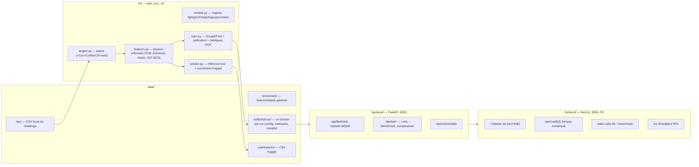
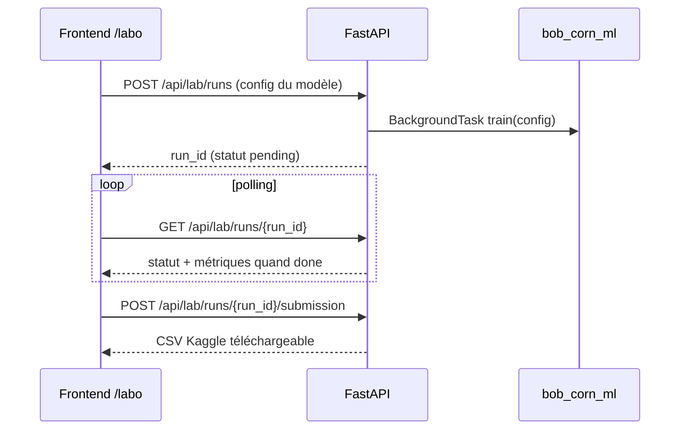

# Architecture — Bob-corn

Prédiction du risque de corrosion des voilures d'aéronefs à partir de l'exposition environnementale au sol (HAKS 2026 — Airbus × IBM × AWS). Application 100 % locale : pipeline ML Python, API FastAPI (port 8000), frontend Next.js (port 3000).

## Vue d'ensemble

## Flux d'un benchmark depuis le frontend

## Dossiers

| Dossier | Rôle |
|---|---|
| `data/raw/` | CSV du challenge (versionnés) |
| `data/processed/`, `data/artifacts/`, `data/submissions/` | Générés, non versionnés |
| `ml/` | Package Python `bob_corn_ml` (pipeline complet) |
| `backend/` | API FastAPI |
| `frontend/` | Application Next.js + shadcn/ui (français) |
| `docs/` | Documentation projet (conçue pour les agents IA — voir `docs/llms.txt`) |
| `notebooks/` | Travaux d'investigation (01→05) |
| `output/` | Sorties horodatées des notebooks |

Voir `docs/00_INDEX.md` pour la documentation complète.
