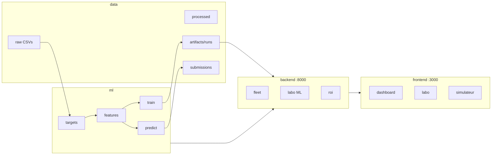

# Architecture CorroTwin



## Ports

| Service | Port |
|---------|------|
| FastAPI | 8000 |
| Next.js | 3000 |

## Démarrage

```bash
make setup
make train
make api   # terminal 1
make web   # terminal 2
```
